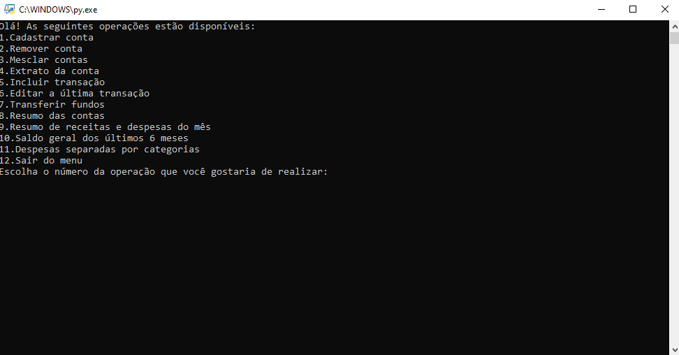

# gerenciamento_despesas_pessoais
Desenvolvimento do processo seletivo para o estágio IT Academy PUCRS/DELL

## Sobre o projeto
Desenvolvimento de um sistema de gerenciamento de despesas pessoais para o processo seletivo do estágio IT Academy da PUCRS/DELL. O sistema permite que um único usuário adicione diversas contas pessoais. Cada conta pode conter diversas transações, que podem ser criadas e editadas pelo usuário. O sistema permite visualizar a movimentação de cada conta, de acordo com as transações adicionadas. Assim como permite ter uma visão geral dos gastos do usuário por demonstrativo geral das contas.

## Construído com
Python

## Pré-requisitos
Python 3.10 ou mais atual

## Como começar
Clicar duas vezes no arquivo 'gerenciamento_despesas_pessoais.py'

## Como usar
Ao rodar o programa, o menu inicial com todas as operações disponíveis irá aparecer. É necessário escolher uma das operações disponíveis e preencher o sistema com as informações que irá solicitar. Caso haja algum erro, o sistema irá indicar e irá abrir o menu inicial.

## Contato
<https://www.linkedin.com/in/carolinamartello/>